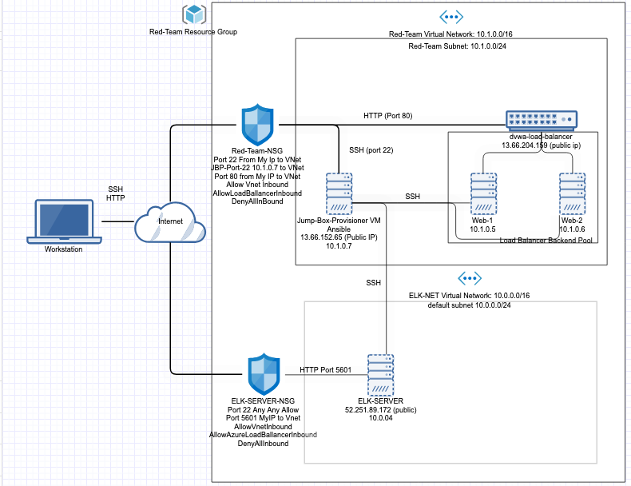
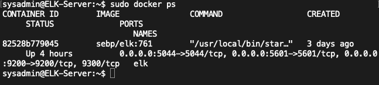

# Arizona State University Cybersecurity Bootcamp Project

## Automated ELK Stack Deployment

The files in this repository were used to configure the network depicted below.

These files have been tested and used to generate a live ELK deployment on Azure. They can be used to either recreate the entire deployment pictured above. Alternatively, select portions of the playbook (.yml) file may be used to install only certain pieces of it, such as Filebeat.

  The following ansible-playbooks are needed to create and install DVWA and the ELK-server
  * [my-playbook.yml](YML-Playbooks/my-playbook.yml) - used to install DVWA servers
  * [elk-playbook.yml](YML-Playbooks/elk-playbook.yml) - used to install ELK Server
    * [filebeat-playbook.yml](YML-Playbooks/filebeat-playbook.yml) - Used to install and configure Filebeat on Elk Server and DVWA servers
    * [metricbeat-playbook.yml](YML-Playbook) - Used to install and configure Metricbeat on Elk Server and DVWA servers

This document contains the following details:
- Description of the Topology
- Access Policies
- ELK Configuration
  - Beats in Use
  - Machines Being Monitored
- How to Use the Ansible Build

### Description of the Topology

The main purpose of this network is to expose a load-balanced and monitored instance of DVWA, the D*mn Vulnerable Web Application.

Load balancing ensures that the application will be highly available, in addition to restricting access to the network.
Load Balancing ensures availability to the web-servers which is the availability aspect of security in regards to the CIA Triad.

What is the advantage of a jump box?
The main advantage of using a JumpBox is having one origination point for administrative tasks. This ultimately sets the JumpBox as a Secure Admin Workstation (SAW). In order to conduct administrative tasks administrators are required to access the JumpBox before accessing the other servers.

Integrating an ELK server allows users to easily monitor the vulnerable VMs for changes to the logs and system traffic.
* Filebeat watches for log files/locations and collect log events. (Filebeat: Lightweight Log Analysis &amp; Elasticsearch)
* Metricbeat records metrics and statistical data from the operating system and from services running on the server (Metricbeat: Lightweight Shipper for Metrics)

The configuration details of each machine may be found below.

| Name       | Function                   | IP Address | Operating System         |
|------------|----------------------------|------------|--------------------------|
| Jump Box   | Gateway                    | 10.1.0.7   | Linux (Ubuntu 18.04 LTS) |
| Web-1      | Web Server - Docker - DVWA | 10.1.0.5   | Linux (Ubuntu 18.04 LTS) |
| Web-2      | Web Server - Docker - DVWA | 10.1.0.6   | Linux (Ubuntu 18.04 LTS) |
| ELK-Server | ELK Stack                  | 10.0.0.4   | Linux (Ubuntu 18.04 LTS) |

### Access Policies

The machines on the internal network are not exposed to the public Internet.

Only the Jump Box Provisioner machine can accept connections from the Internet. Access to this machine is only allowed from the following IP addresses:
* Personal IP Address

Machines within the network can only be accessed by SSH.
* The ELK-Server is only accessible by SSH from the JumpBox and via web access from Personal IP Address.

A summary of the access policies in place can be found in the table below.

| Name       | Publicly Accessible     | Allowed IP Address                                 |
|------------|-------------------------|----------------------------------------------------|
| Jump-Box   | No                      | Personal IP Address                                |
| Web-1      | Yes Thru Load Ballancer | 13.66.204.159 LB Public IP 10.0.0.4 - JumpBox      |
| Web-2      | Yes Thru Load Ballancer | 13.66.204.159 LB Public IP 10.0.0.4 JumpBox        |
| ELK-Server | No                      | SSH 10.0.0.4 - JumpBox HTTP Port 5601 Personal IP  |

### Elk Configuration

Ansible was used to automate configuration of the ELK machine. No configuration was performed manually, which is advantageous because...
- The main advantage of automating the installation process is that we could deploy multiple servers easily and quickly without having to
physically touch each server.

The playbook implements the following tasks:
1. Install Docker.io and pip3
2. Increases VM memory
3. Download and Configure elk docker container
4. Sets Published Ports

The following screenshot displays the result of running `docker ps` after successfully configuring the ELK instance.

### Target Machines & Beats
This ELK server is configured to monitor the following machines:
* Web-1 10.1.5
* Web-2 10.1.6

We have installed the following Beats on these machines:
* Filebeat
* Metricbeat

These Beats allow us to collect the following information from each machine:
* Filebeat watches for log files/locations and collect log events. (Filebeat: Lightweight Log Analysis &amp; Elasticsearch)
* Metricbeat records metrics and statistical data from the operating system and from services running on the server (Metricbeat: Lightweight Shipper for Metrics)

### Using the Playbook
In order to use the playbook, you will need to have an Ansible control node already configured. Assuming you have such a control node provisioned:

SSH into the control node and follow the steps below:
- Copy the filebeat-config.yml and metricbeat-config.yml file to /etc/ansible/files.
- Update the configuration files to include the Private IP of the ELK-Server to the ElasticSearch and Kibana Sections of the Configuration File
- Run the playbook, and navigate to ELK-Server-PublicIP:5601/app/kibana to check that the installation worked as expected.

Which file is the playbook?
The playbook files are:
* [elk-playbook.yml](YML-Playbooks/elk-playbook.yml) - used to install ELK Server
  * [filebeat-playbook.yml](YML-Playbooks/filebeat-playbook.yml) - Used to install and configure Filebeat on Elk Server and DVWA servers
  * [metricbeat-playbook.yml](YML-Playbook) - Used to install and configure Metricbeat on Elk Server and DVWA servers

Where do you copy it?

/etc/ansible/

Which file do you update to make Ansible run the playbook on a specific machine?

/etc/ansible/hosts.cfg

How do I specify which machine to install the ELK server on versus which to install Filebeat on?

In /etc/ansible/hosts you tell it where you want eachto be installed ElkServers or FileBeat

Which URL do you navigate to in order to check that the ELK server is running?

http://publicip(elkserver):5601

### Commands needed to run the Anisble Configuration for the Elk-Server are:
1. ssh RedAdmin@JumpBox(PrivateIP)
2. sudo docker container list -a - Locate the ansible container
3. sudo docker start <name of container>(Funny_Name)
4. sudo docker attach <name of container>(Funny_Name)
5. cd /etc/ansible
6. ansible-playbook elk-playbook.yml (Installs and Configures ELK-Server)
7. cd /etc/ansible/
8. ansible-playbook beats-playbook.yml (Installs and Configures Beats)
9. Open a new browser on Personal Workstation, navigate to (ELK-Server-PublicIP:5601/app/kibana) - This will bring up Kibana Web Portal

### References
Filebeat: Lightweight Log Analysis &amp; Elasticsearch. (n.d.). Retrieved August 22, 2020, from https://www.elastic.co/beats/filebeat
Metricbeat: Lightweight Shipper for Metrics. (n.d.). Retrieved August 22, 2020, from https://www.elastic.co/beats/metricbeat
